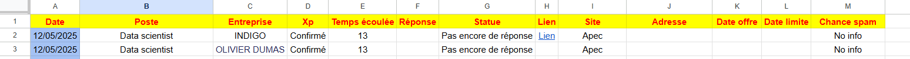

Ce projet a pour but d'automatiser un journal de mes candidatures sur les différents sites de recrutement.

En théorie, ce que je veut accomplir est la remplissage automatique d'une majorité des taches.

Ce dont j'aurai besoin :
- VScode / Google Apps Script
- Un fichier Excel / Google Sheets
- Un accès à ma messagerie via Google Sheets
- Une connexion Internet pour récupérer les sources

Le journal ressemble à ceci : 

Le code va scraper :
- Le poste
- L'entreprise
- Un indicateur d'expérience
- Le site sur lequel j'ai postulé
- L'adresse / localisation
- La date de l'offre et la date limite (_optionnel_)

Le reste est déduit de ces informations.

Le filtrage des mails ne se fait pas via une API vers un LLM (GPT, Gemini, etc.), car cela impliquerait de transmettre des informations sensibles et personnelles.

Un modèle de machine learning n’est pas envisageable non plus, car je ne dispose pas de données d'entraînement.

J’ai donc opté pour un système de filtrage évolutif, que je teste et améliore progressivement, afin qu’il puisse accomplir cette tâche.

**Edit 24/05/2025** : J’ai terminé la partie post-candidature, c’est-à-dire que le code analyse les mails reçus(poste, entreprise, réponse) et identifie une réponse en se basant sur le contenu du mail. Cela permet donner une valeurs sur la colonne **Réponse**, de figer la valeur du temps écoulé depuis la candidature et d'ajouter une couleur de fond.

**Edit 25/05/2025** : 
- Ajout d’une macro qui transforme un lien brut (ex. : https:) en un hyperlien avec le texte Lien, redirigeant vers l’URL.

- Ajout d’une macro qui, lorsqu’une nouvelle ligne est ajoutée, applique automatiquement un drag down (copie automatique) sur les colonnes qui dépendent d'autres données (date, statut, etc.).

**Edit 28/05/2025** : 
- Création d'une database avec les réponses des candidatures recu (mailscraping) → Utilisation de ML dès que la database est assez remplie (Majorité % en refus, % entretien < 10%)
- Mise à jour des filtres afin de mettre à jour les réponses recus
- 

